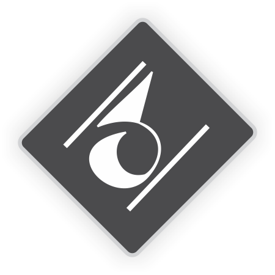

## The structure of user synthetics has been updated. This notice will be removed once the documentation has been updated

<div align="center">
	
	<h1>User Synthetics</h1>
	<p>Modular PHP Framework for Customizable and Extensible Web Applications</p>
	<a href="https://uss.ucscode.me/docs"><strong>Explore the User Synthetics docs »</strong></a>
	<br>
	<br>
</div>

## Table of Contents

- [Introduction](#introduction)
- [Demo](#demo)
- [Features](#features)
- [Getting Started](#getting-started)
- [Documentation](#documentation)
- [Examples](#examples)
- [Contributing](#contributing)
- [License](#license)
- [Acknowledgements](#acknowledgements)

## Introduction

User Synthetics is a powerful and versatile PHP framework designed to simplify the development of customizable and extensible web applications. With User Synthetics, you can create robust platforms tailored to your specific requirements, thanks to its modular architecture and user-friendly interface.

The framework provides a solid foundation, incorporating essential third-party libraries like Bootstrap, Toastr.js, and Bootbox, to empower developers with a comprehensive set of tools for building modern and interactive web applications.

## Demo

Check out the video showcase of User Synthetics in action:

[](https://uss.ucscode.me/videos)

Click the image above or <a href='https://uss.ucscode.me/videos' target='_blank'>**click here**</a> to watch the video.

---

A live demo of User Synthetics has been prepared for you to explore and experience its capabilities. The demo showcases various features and modules of the framework, giving you a glimpse of its flexibility and functionality.

**[Access the User Synthetics Live Demo](https://uss.ucscode.me/demo)**

> Please note that the demo is for exploration purposes only, and any changes or data entered in the demo environment will not be saved.

## Features

- **Modular Architecture:** User Synthetics embraces a modular architecture that allows you to easily extend and customize your application. You can create custom modules to enhance the functionality and tailor the platform to your unique needs.

- **Intuitive API:** User Synthetics provides an expressive and intuitive API, making it a breeze to develop web applications. The framework's API is designed to streamline development and improve developer productivity.

- **Lightweight and Efficient:** User Synthetics is built with performance in mind. It offers a lightweight and efficient design that ensures optimal performance, delivering a smooth user experience.

- **Essential Classes:** The framework includes several built-in classes to facilitate common tasks and reduce development time. These classes include event handling, data storage, HTML table generation, hierarchical menu structures, simplified SQL statements, key-value data storage, and HTML syntax conversion.

- **Mini Template Engine:** User Synthetics features a mini template engine that simplifies dynamic content replacement within HTML templates. This allows you to easily customize and personalize the user interface of your application.

## Getting Started

Follow these steps to get started with User Synthetics:

1. Clone the repository: `git clone https://github.com/ucscode/user-synthetics.git`.
2. Set up your web server to serve the cloned directory as the document root.
3. Customize the framework and modules to suit your project's requirements.
4. Refer to the [User Synthetics documentation](https://uss.ucscode.me/docs) for detailed usage instructions and guides.

## Documentation

Comprehensive documentation is available for User Synthetics to assist you in using and extending the framework effectively. The documentation covers various topics, including installation, module development, API references, and best practices. Visit the [User Synthetics Documentation](https://uss.ucscode.me/docs) to explore the resources.

## Contributing

User Synthetics is an open-source project developed with a vision to foster a thriving and collaborative community. Contributions from developers are welcome to make User Synthetics even better. 

If you have ideas for new features, bug fixes, or improvements, you can submit a pull requests. Help enhance the framework and make it more powerful and flexible but endeavor to retain it lightweight nature.

**Report Issues:** If you come across any issues or bugs while using User Synthetics, please expose it by opening an issue in the [Issue Tracker](https://github.com/ucscode/user-synthetics/issues). Your feedback is valuable and will help improve the stability and reliability of the framework.

## License

User Synthetics is released under the GNU General Public License (GPL) version 3 or later. For more information about, please refer to the [LICENSE](https://www.gnu.org/licenses/gpl-3.0.html) file.

## Events Naming Convention

This is not a recommendation but can be helpful to define or get event names used across user synthetics

```php
Events::addListener('uss:pages/users@nav.dropdown', ...);
```

The above event name `uss:pages/users@nav.dropdown` can be broken down to:

-  `uss:`  &mdash; The identity / source of the event
-  `pages/users`  &mdash;  The event name or possible point of execution
-  `@nav`  &mdash;  An element in which the event can be found or referenced. In this case `<nav>`
-  `.dropdown`
	- May signify action spanning the event. Other examples may include `.click`, `.submit` etc. 
	- It may also be used to reference element position of an event such as `.top`, `.left`, `.right`, or `.bottom` 

## Acknowledgements

User Synthetics is developed and maintained by [ucscode](https://ucscode.me). If you have any questions, suggestions, or need assistance, please feel free to reach out.

